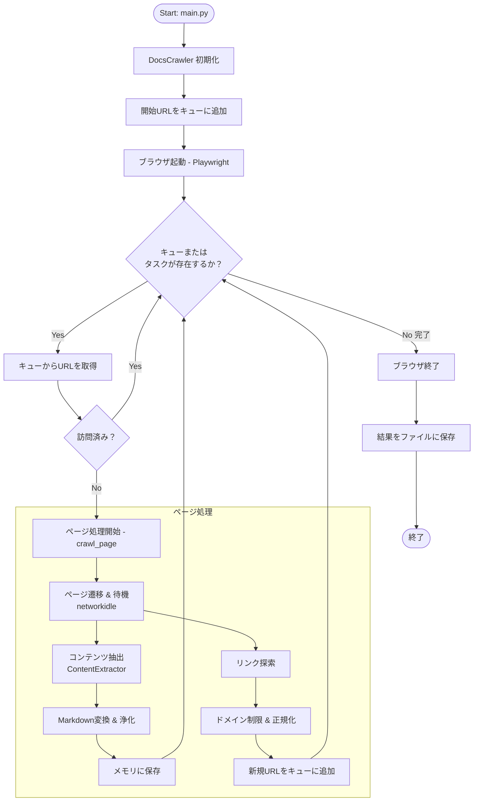

# 処理遷移図 (Process Flow)

```mermaid
graph TD
    %% 初期化フェーズ
    Start([Start: main.py]) --> Init["DocsCrawler 初期化"]
    Init --> EnqueueStart["開始URLをキューに追加"]
    EnqueueStart --> Launch["ブラウザ起動 - Playwright"]
    
    %% メインループ (非同期処理)
    Launch --> CheckLoop{"キューまたは<br>タスクが存在するか？"}
    
    CheckLoop -- No 完了 --> Close["ブラウザ終了"]
    Close --> Save["結果をファイルに保存"]
    Save --> End([終了])
    
    CheckLoop -- Yes --> Consume["キューからURLを取得"]
    Consume --> VisitedCheck{"訪問済み？"}
    
    VisitedCheck -- Yes --> CheckLoop
    VisitedCheck -- No --> CrawlPage["ページ処理開始 - crawl_page"]
    
    %% ページ処理詳細
    subgraph PageProcessing [ページ処理]
        CrawlPage --> Navigate["ページ遷移 & 待機<br>networkidle"]
        Navigate --> Extract["コンテンツ抽出<br>ContentExtractor"]
        Extract --> Convert["Markdown変換 & 浄化"]
        Convert --> Store["メモリに保存"]
        
        Navigate --> FindLinks["リンク探索"]
        FindLinks --> Filter["ドメイン制限 & 正規化"]
        Filter --> EnqueueNew["新規URLをキューに追加"]
    end
    
    Store --> CheckLoop
    EnqueueNew --> CheckLoop
```
